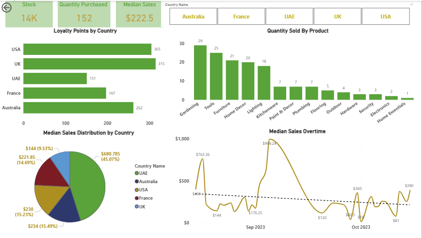
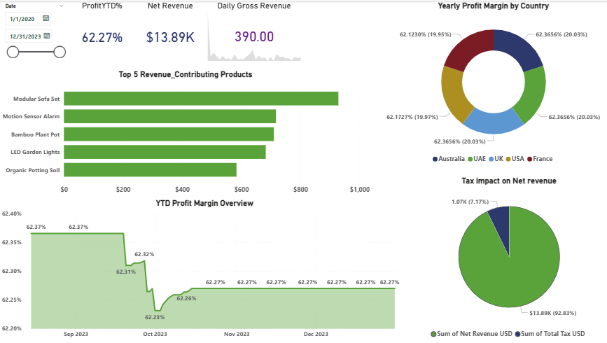
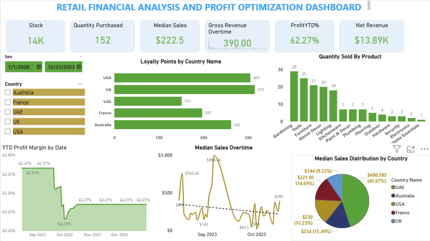
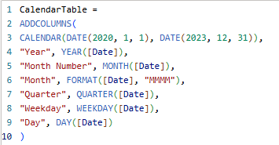
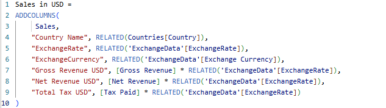
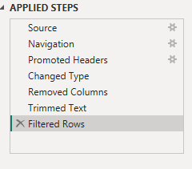
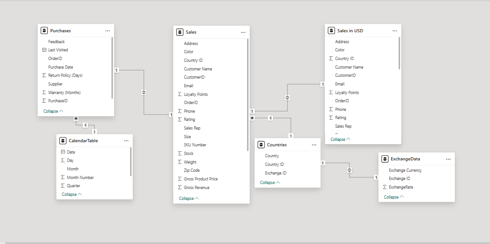
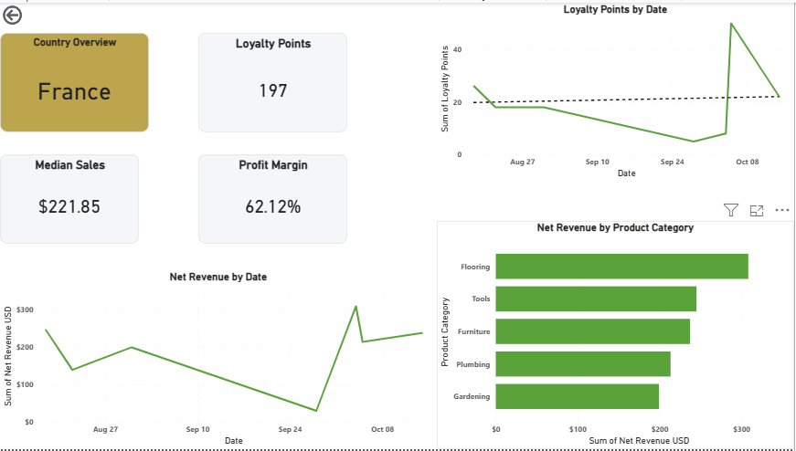

# Tailwind Traders – Sales & Profit Optimization Analytics

## Executive Financial Analytics Project

- End-to-end business intelligence workflow for Tailwind Traders, designed to transform raw transactional data into actionable insights  
- Cleaned, validated, and enriched multiple datasets to ensure accuracy, consistency, and readiness for analysis  
- Developed a snowflake-modeled data structure with user-defined tables and advanced DAX measures for robust financial modeling  
- Built interactive dashboards highlighting key performance indicators including stock levels, median sales, loyalty points, net revenue, profit YTD %, and gross revenue trends  
- Delivered multi-dimensional insights across products, categories, and regions to support strategic decision-making  
- Key business insights identified:  
  - UK achieved the highest loyalty points  
  - UAE recorded the greatest median sales  
  - Gardening products were the top-selling category  
  - Modular Sofa Set generated the highest revenue  
- Demonstrates strong capabilities in data preparation, modeling, DAX calculations, and dashboard development  
- Provides a scalable, executive-ready tool to monitor performance, optimize profitability, and inform data-driven business decisions
---

## Strategic Objective

Design a scalable analytical framework to:

- Monitor revenue and profitability performance  
- Standardize multi-currency financial reporting  
- Evaluate product-level contribution  
- Compare regional market performance  
- Support data-driven executive decision-making  

---

## Technology Stack

- Power BI  
- Excel  
- DAX (Data Analysis Expressions)  
- Power Query  
- Snowflake Data Modeling Architecture  

---

## Solution Architecture

### Data Preparation
- Standardized multi-source datasets  
- Removed duplicates and inconsistencies  
- Corrected data types and validated integrity  
- Engineered financial metrics (Gross Revenue, Net Revenue, Tax)

### Data Modeling
- Designed scalable snowflake schema  
- Built Calendar table for time intelligence (YTD, Quarterly trends)  
- Developed Exchange Rate table for currency normalization  
- Created Sales in USD model for unified financial reporting  

### Analytics Layer (DAX)
- Gross Profit (USD)  
- Profit Margin %  
- Profit YTD %  
- Quarterly Profit  
- Median Sales  
- Time-based revenue aggregations  

### Presentation Layer
- Sales Performance Dashboard  
- Profitability Overview Dashboard  
- Country-Level Drill-Through Analysis  
- Cross-filtered KPI reporting  

---

## Dashboard Preview

### Sales Performance Report

### Profitability Overview Report

### Sales and Profit Optimization Dashboard

### Calendar Table DAX

### Sales in USD DAX

### Power Query Cleaning

### Data Model

### Country Drill Through

---

## Key Financial Insights

- **Net Revenue:** $13.89K  
- **Profit Margin Stability:** ~62% across reporting periods  
- **Largest Revenue Contributor:** USA (~45%)  
- **Top Product Category:** Gardening  
- **Highest Revenue Product:** Modular Sofa Set  
- **Growth Opportunity Identified:** UAE Market  

---

## Business Impact

- Structured revenue and margin monitoring framework  
- Enhanced product-level profitability visibility  
- Regional benchmarking for strategic expansion  
- Scalable reporting architecture  
- Executive-ready financial performance dashboards  

---

## Challenges & Analytical Approach

- Estimated cost structure (35% of gross price) to simulate margin modeling  
- Implemented currency normalization via Exchange Data table  
- Stabilized data inconsistencies through structured Power Query validation  

---

## Skills Demonstrated

Financial Performance Analysis  
Data Modeling & Relationship Optimization  
DAX & Time Intelligence  
KPI Framework Development  
Executive Dashboard Design  
Business Insight Communication  

---

## Project Files / Documentation

- 📄 [Full Project Documentation PDF](Tailwind_Poject_Documentation.pdf)  
- 📥 [Power BI File](Tailwinds_Traders_Sales.pbix)

---

## Professional Positioning

BBA (Accounting) Student  
Aspiring Financial Analyst  

Focused on integrating financial strategy, analytical modeling, and business intelligence to drive structured decision-making.
